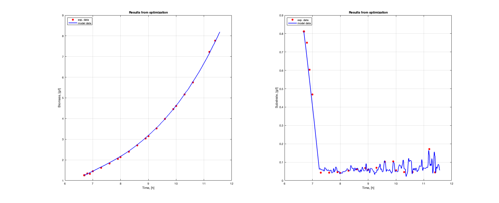

# WOA Metaheuristics in Matlab
## Hyperparameter Optimization and Algorithm Comparison

This repository contains the Whale Optimization Algorithm (WOA) for hyperparameter optimization and compares its performance with other metaheuristic algorithms including Genetic Algorithm (GA), Simulated Annealing (SA), and Crow Search Algorithm (CSA). The algorithms are implemented in MATLAB.

## Project Description

This project focuses on:
- Implementation of WOA and other optimization algorithms in MATLAB
- Comparative analysis of algorithm performance across various test functions
- Hyperparameter tuning for optimal algorithm configurations
- Visualizations 

## Whale Optimization Algorithm

WOA is a nature-inspired metaheuristic algorithm that simulates the hunting behavior of humpback whales. The algorithm models three operations:
- Search for prey (exploration)
- Encircling prey
- Bubble-net attacking method (exploitation)

## Results

Below is a visualization of biomass and substrate results with 300 whales and 30 iterations:

## References

- The Whale Optimization Algorithm (Original paper by Mirjalili & Lewis, 2016) (https://www.sciencedirect.com/science/article/abs/pii/S0965997816300163)
